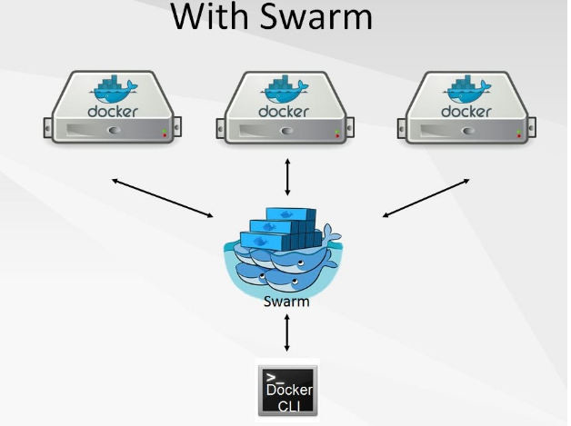
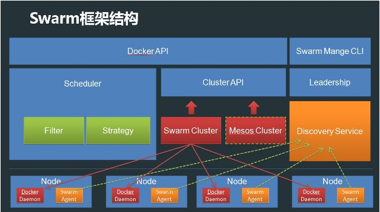
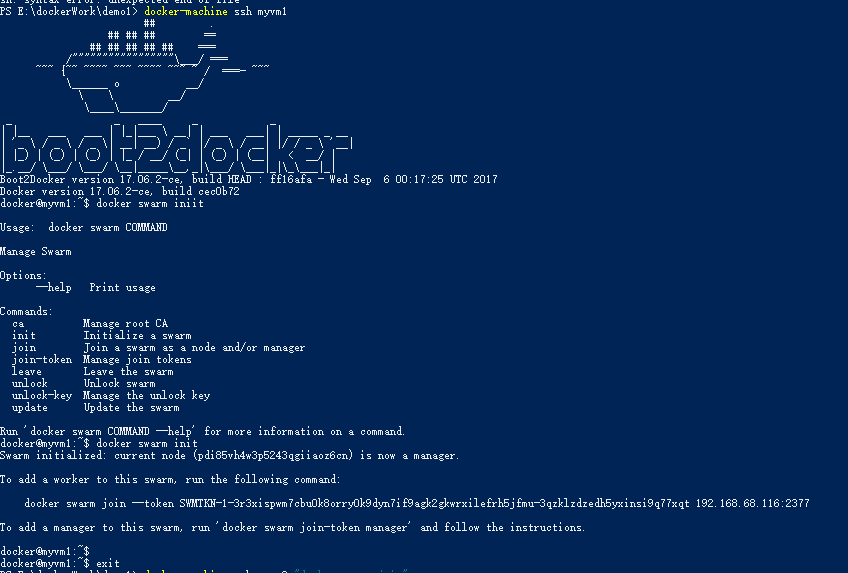
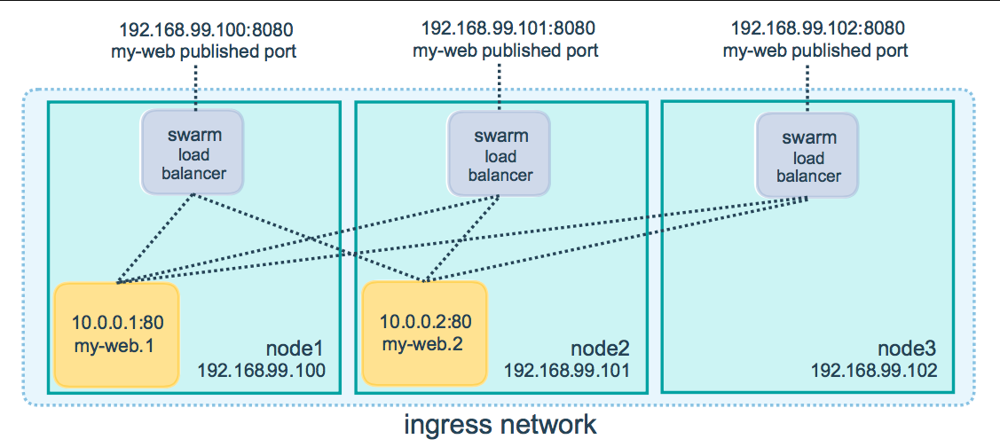

# Docker Swarm

> A swarm is a group of machines that are running Docker and joined into a cluster. After that has happened, you continue to run the Docker commands you’re used to, but now they are executed on a cluster by a `swarm manager`. The machines in a swarm can be physical or virtual. After joining a swarm, they are referred to as `nodes`.

## Swarm是什么

> 通过把多个Docker Engine聚集在一起，形成一个大的docker-engine，对外提供容器的集群服务。同时这个集群对外提供Swarm API，用户可以像使用Docker Engine一样使用Docker集群。



## Swarm 特点

1. 对外以Docker API接口呈现，这样带来的好处是，如果现有系统使用Docker Engine，则可以平滑将Docker Engine切到Swarm上，无需改动现有系统。
2. Swarm对用户来说，之前使用Docker的经验可以继承过来。非常容易上手，学习成本和二次开发成本都比较低。同时Swarm本身专注于Docker集群管理，非常轻量，占用资源也非常少。
3. `Batteries included but swappable`，简单说，就是插件化机制，Swarm中的各个模块都抽象出了API，可以根据自己一些特点进行定制实现。
4. Swarm自身对Docker命令参数支持的比较完善，Swarm目前与Docker是同步发布的。Docker的新功能，都会第一时间在Swarm中体现。

***

## Swarm框架结构



* Swarm对外提供两种API， 一种是Docker API，用于负责容器镜像的生命周期管理， 另外一种是Swarm集群管理CLI，用于集群理。
* Scheduler模块，主要实现调度功能。在通过Swarm创建容器时，会经过Scheduler模块选择出一个最优节点，里面包含了两个子模块，分别是Filter和Strategy， Filter用来过滤节点，找出满足条件的节点（比如资源足够，节点正常等等），Strategy用来在过滤出的节点中根据策略选择一个最优的节点（比如对找出的节点进行对比，找到资源最多的节点等等）, 当然Filter/Strategy用户可以定制。
* Swarm对集群进行了抽象，抽象出了Cluster API，Swarm支持两种集群，一种是Swarm自身的集群，另外一种基于Mesos的集群。
* LeaderShip模块用于Swarm Manager自身的HA，通过主备方式实现。
* Discovery Service 服务发现模块，这个模块主要用来提供节点发现功能。
* 在每一个节点上，都会有一个Agent，用于连接Discovery Service，上报Docker Daemon的IP端口信息，Swarm Manager会直接从服务发现模块中读取节点信息。

***

## 创建群集 (docker for windows)

>本案例用的是 win10 的 `hyper-V` 功能
> mac,linux,windows7/8 参考官网: https://docs.docker.com/get-started/part4/#understanding-swarm-clusters

### 利用 `hyper-v` 在你的机器上创建两个docker 环境

1. 启用 `Hyper-V` 管理器
2. 点击虚拟交换机管理,创建一个 `外部` 类型的虚拟交换机
3. 给你的虚拟交换机取名 `myswitch`
4. create a couple of VMs using our node management tool,`docker-machine`
5. 发现下载 `boot2docker.iso` 失败或者超时, 可到这个地址下载 `https://github.com/boot2docker/boot2docker/releases/download/v17.06.2-ce/boot2docker.iso` 然后将它放在你的 个人资源管理器 `\.docker\machine\cache`, 例如我的: `C:\Users\carzy\.docker\machine\cache`

```bash
  docker-machine create -d hyperv --hyperv-virtual-switch "myswitch" myvm1
  docker-machine create -d hyperv --hyperv-virtual-switch "myswitch" myvm2
  # 此过程很慢
```

### 查看刚刚创建的虚拟docker列表和IP

```bash
docker-machine ls `
NAME    ACTIVE   DRIVER   STATE     URL                         SWARM   DOCKER
myvm1   -        hyperv   Running   tcp://192.168.68.116:2376           v17.06.2-ce
myvm2   -        hyperv   Running   tcp://192.168.68.114:2376           v17.06.2-ce
```

<!--  -->

### 启动群集添加节点

> 第一台机器将作为 `manager` ，执行管理指令和认证人员加入群，和第二将作为 `worker`

* `docker-machine ssh` 登录你的第一个 VM, 并将 `myvm1` 指定为 `manager` : `docker swarm init`

```bash
docker-machine ssh myvm1 "docker swarm init --advertise-addr <myvm1 ip>"

docker@myvm1:~$ docker swarm init
Swarm initialized: current node (pdi85vh4w3p5243qgiiaoz6cn) is now a manager.

To add a worker to this swarm, run the following command:

    docker swarm join --token SWMTKN-1-3r3xispwm7cbu0k8orry0k9dyn7if9agk2gkwrxilefrh5jfmu-3qzklzdzedh5yxinsi9q77xqt 192.168.68.116:2377

To add a manager to this swarm, run 'docker swarm join-token manager' and follow the instructions.
```



> **端口2377和2376**
> 始终运行 `docker swarm init`和 `docker swarm join` 端口2377（群组管理端口），或使其为默认值。
> 返回的机器IP地址 `docker-machine ls` 包括端口2376，它是Docker守护程序端口。不要使用这个端口，否则 可能会遇> 到错误。

* 响应 `docker swarm init`包含预先配置的 `docker swarm join`命令(上条docker swarm init 提示的 `token`)，以便您在要添加的任何节点上运行。复制此命令，并将其发送到myvm2, `docker-machine ssh` 让myvm2 加入您的新群组作为`worker`

```bash
docker swarm join --token SWMTKN-1-3r3xispwm7cbu0k8orry0k9dyn7if9agk2gkwrxilefrh5jfmu-3qzklzdzedh5yxinsi9q77xqt 192.168.68.116:2377

This node joined a swarm as a worker.
```

* `docker node ls` 在管理器上运行以查看此群组中的节点

```bash
PS E:\dockerWork\demo1> docker-machine ssh myvm1 "docker node ls"
ID                            HOSTNAME            STATUS              AVAILABILITY          MANAGER STATUS
pdi85vh4w3p5243qgiiaoz6cn *           myvm1               Ready               Active              Leader
tra1o8vdg9y4z16uv0nl731y8            myvm2               Ready               Active
```

>`离开群`
> 如果要重新开始，可以从每个节点运行 `docker swarm leave`

***

### 部署应用

#### 将docker-machineshell 配置为群组管理器

> 到目前为止，已经将Docker的commmands包装在 `docker-machine ssh`与VM进行通话。另一个选项是运行 `docker-machine env <machine>` 以获取并运行一个配置当前shell的命令来与虚拟机上的 `Docker守护程序` 通信。它允许使用本地docker-compose.yml文件“远程”部署应用程序，而无需将其复制到任何位置。
* Run `docker-machine env myvm1` to get the command to configure your shell to talk to myvm1.
* Run the given command to configure your shell to talk to myvm1
* Run `docker-machine ls` to verify that myvm1 is the active machine as indicated by `*` next to it

<!--  -->

#### 开始部署

* 现在你有我的myvm1，你可以使用`myvm1` 的权力作为一个群组管理器来部署您的应用程序，使用 `docker stack deploy` 命令，运行 `docker-stack.yml`.

```bash
  docker stack deploy -c docker-compose.yml test
```

#### 检测

* `docker service ps test` 可以看到5个容器，分别运行在 myvm1 和 myvm2 上
* 通过浏览器访问任意一个 ip 的，都可以看见 5 个 不同的 ID
* IP地址工作的原因是群集中的 `nodes` 加入 ` ingress network routing mesh` 。这样可以确保在群集中某个端口部署的服务始终将该端口保留给其自身，无论实际运行的是哪个节点。以下是在三节点群集my-web端口8080上发布的服务的路由网格如何显示：
  

> **连通问题**
> 为了在群集中使用入口网络 `ingress network` ，在启用群组模式之前，需要在群集节点之间打开以下端口
> * 端口7946 TCP / UDP用于容器网络发现。
> * 端口4789 UDP用于容器入口网络.

### 迭代和缩放您的应用程序

  1. 通过更改docker-compose.yml文件来缩放应用程序
  2. 通过编辑代码来更改应用程序行为
    * 在这两种情况下，只需 `docker stack deploy` 再次运行以部署这些更改.
    * 您可以使用与 `docker swarm join` 您使用的相同的命令将任何物理或虚拟机加入此群集 `myvm2` ，并将容量添加到群集中。`docker stack deploy` 运行后，您的应用程序将利用新的资源。

### 清理

使用 `docker stack rm` 进行清理所有这个stack
> *Keep the swarm or remove it*
> `docker-machine ssh myvm2 "docker swarm leave"` 将 myvm2  从swarm的 `worker` 中移除
> `docker-machine ssh myvm1 "docker swarm leave --force` myvm1 从 swarm的 `manager` 中移除