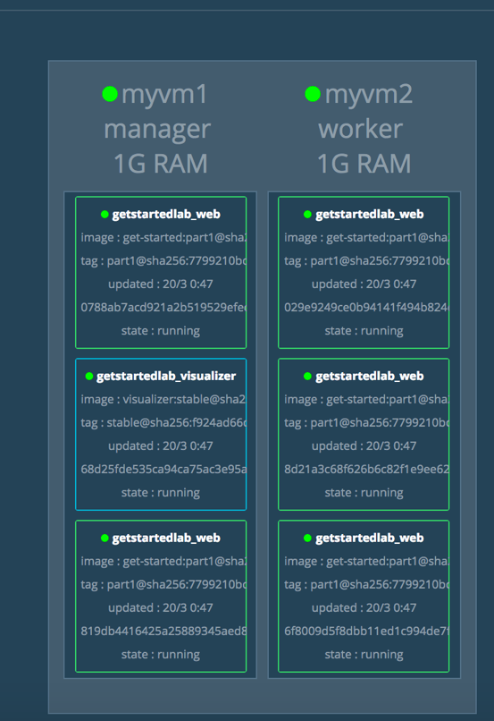
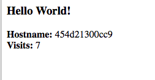
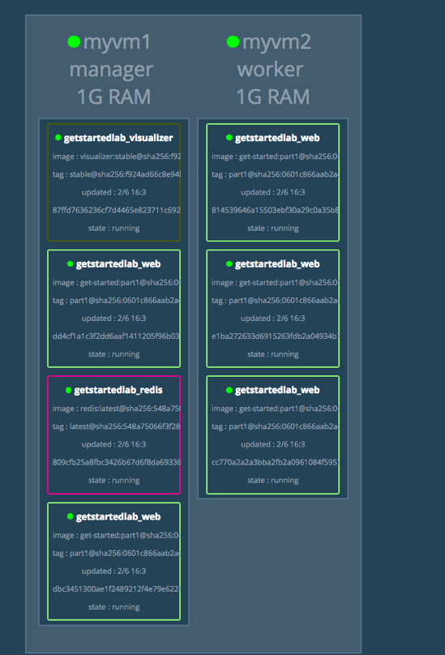

# docker stack

> 将到达分布式应用程序层次结构的顶部：堆栈。堆栈是一组相互关联的服务，共享依赖关系，并且可以协调一致。单个堆栈能够定义和协调整个应用程序的功能（尽管非常复杂的应用程序可能希望使用多个堆栈）。

## 添加新服务并重新部署

很容易为我们的docker-compose.yml文件添加服务。首先，我们添加一个免费的可视化服务，让我们看看我们的群集如何调度容器。

1. `docker-compose.yml` 在编辑器中打开并将其内容替换为以下内容。请务必更换 `username/repo:tag` 您的图像细节。

```yml
version: "3"
services:
  web:
    # replace username/repo:tag with your name and image details
    image: username/repo:tag
    deploy:
      replicas: 5
      restart_policy:
        condition: on-failure
      resources:
        limits:
          cpus: "0.1"
          memory: 50M
    ports:
      - "80:80"
    networks:
      - webnet
  visualizer:
    image: dockersamples/visualizer:stable
    ports:
      - "8080:8080"
    volumes:
      - "/var/run/docker.sock:/var/run/docker.sock"
    deploy:
      placement:
        constraints: [node.role == manager]
    networks:
      - webnet
networks:
  webnet:
```

这里唯一新的是对等服务web，命名visualizer。您将在这里看到两个新的东西：一个volumes关键字，让可视化程序访问Docker的主机套接字文件以及一个placement关键字，确保这个服务只能运行在群组管理器上，而不是工作人员。这是因为由Docker创建的开源项目构建的这个容器显示了在图中以群集运行的Docker服务。

2. 确保你的shell被配置为通话myvm1（全部的例子在这里）。

- 运行docker-machine ls列出机器，并确保您已连接到myvm1，如下星号所示。
- 如果需要，重新运行docker-machine env myvm1，然后运行给定的命令配置shell。

在Mac或Linux上，命令是：`eval $(docker-machine env myvm1)`

在Windows上，命令是：`& "C:\Program Files\Docker\Docker\Resources\bin\docker-machine.exe" env myvm1 | Invoke-Expression`

1. docker stack deploy在管理员上重新运行命令，任何需要更新的服务将被更新：

```bash
$ docker stack deploy -c docker-compose.yml getstartedlab
Updating service getstartedlab_web (id: angi1bf5e4to03qu9f93trnxm)
Updating service getstartedlab_visualizer (id: l9mnwkeq2jiononb5ihz9u7a4)
```

1. 看看可视化器。

您在Compose文件中看到在visualizer端口8080上运行docker-machine ls。通过运行获取其中一个节点的IP地址。转到8080端口的IP地址，您将看到可视化运行：


单个副本visualizer正如您所期望的那样在管理器上运行，并且5个实例web分布在群集中。您可以通过运行`docker stack ps <stack>`以下方式来证实这种可视化:

```bash
 docker stack ps getstartedlab
```

可视化器是一种独立的服务，可以在包含在堆栈中的任何应用程序中运行。它不依赖于其他任何东西。现在让我们创建一个确实具有依赖性的服务：Redis服务将提供一个访客计数器。

## 数据

让我们再次浏览相同的工作流程，添加一个用于存储应用数据的Redis数据库。

1. 保存这个新docker-compose.yml文件，最后添加一个Redis服务。请务必更换username/repo:tag您的图像细节。

```yml
version: "3"
services:
  web:
    # replace username/repo:tag with your name and image details
    image: username/repo:tag
    deploy:
      replicas: 5
      restart_policy:
        condition: on-failure
      resources:
        limits:
          cpus: "0.1"
          memory: 50M
    ports:
      - "80:80"
    networks:
      - webnet
  visualizer:
    image: dockersamples/visualizer:stable
    ports:
      - "8080:8080"
    volumes:
      - "/var/run/docker.sock:/var/run/docker.sock"
    deploy:
      placement:
        constraints: [node.role == manager]
    networks:
      - webnet
  redis:
    image: redis
    ports:
      - "6379:6379"
    volumes:
      - /home/docker/data:/data
    deploy:
      placement:
        constraints: [node.role == manager]
    command: redis-server --appendonly yes
    networks:
      - webnet
networks:
  webnet:
```

Redis在Docker图书馆有一个官方形象，并且被赋予了简短的image名字`redis`，所以`username/repo`在这里没有符号。Redis端口6379已由Redis预配置为从容器暴露给主机，在我们的撰写文件中，我们将其从主机公开到世界各地，因此您可以输入任何您的IP地址节点进入Redis Desktop Manager并管理此Redis实例，如果您这样选择。

最重要的是，在`redis`规范中有几件事情使数据在这个堆栈的部署之间保持不变：

- redis 总是在经理上运行，所以它总是使用相同的文件系统。
- redis访问主机文件系统中的任意目录/data，这是Redis存储数据的位置。
  
在一起，这是在您的主机的物理文件系统中为Redis数据创建“真相的根源”。没有这个，Redis会将其数据存储 /data在容器的文件系统内，如果容器被重新部署，那么它将被清除。

这个真理的来源有两个部分：

- 您放置在Redis服务上的放置约束，确保它始终使用相同的主机。
- 您创建的卷允许容器访问./data（在主机上）为/data（在Redis容器内）。当容器来回走动时，存储在./data指定主机上的文件将持续存在，从而实现连续性。
  
您已准备好部署新的Redis使用堆栈。

1. `./data` 在管理器上创建一个目录：

```bash
docker-machine ssh myvm1 "mkdir ./data"
```

1. 确保你的shell被配置为通话myvm1。

- 运行docker-machine ls列出机器，并确保您已连接到myvm1，如下星号所示。
- 如果需要，重新运行docker-machine env myvm1，然后运行给定的命令配置shell。

  在Mac或Linux上，命令是：`eval $(docker-machine env myvm1)`
  在Windows上，命令是：`& "C:\Program Files\Docker\Docker\Resources\bin\docker-machine.exe" env myvm1 | Invoke-Expression`

2. 再运行docker stack deploy一次

```bash
docker stack deploy -c docker-compose.yml getstartedlab
```

3. 运行docker service ls以验证三个服务是否按预期运行。

```bash
$ docker service ls
ID                  NAME                       MODE                REPLICAS            IMAGE                             PORTS
x7uij6xb4foj        getstartedlab_redis        replicated          1/1                 redis:latest                      *:6379->6379/tcp
n5rvhm52ykq7        getstartedlab_visualizer   replicated          1/1                 dockersamples/visualizer:stable   *:8080->8080/tcp
mifd433bti1d        getstartedlab_web          replicated          5/5                 orangesnap/getstarted:latest    *:80->80/tcp
```

1. 检查您的一个节点（例如`http://192.168.99.101`）的网页，您将看到访客计数器的结果，该计数器现在已存在，并存储有关Redis的信息。



另外，检查可视化在上的任一节点的IP地址端口8080，你会看到redis与一起运行服务web和visualizer服务。

