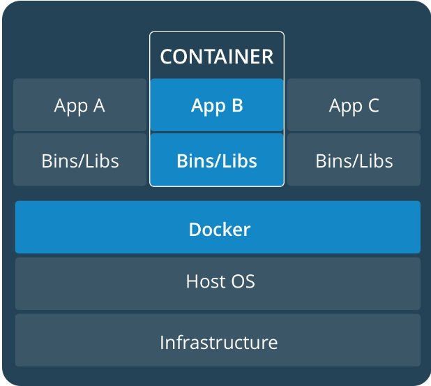
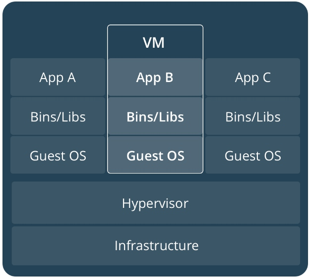
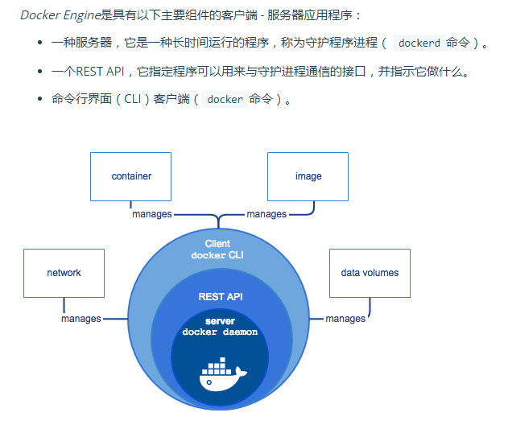

# docker简述

## VM & Docker

> 一般都拿VM与docker做比较，但两者的两个不同的东西，从使用者的角度上看，感觉是一样

### docker

### VM

## docker engine

## Docker守护进程

Docker守护程序（dockerd）监听Docker API请求并管理Docker对象，如图像，容器，网络和卷。守护进程还可以与其他守护进程通信以管理Docker服务

## Docker客户端

Docker client（docker）是许多Docker用户与Docker进行交互的主要方式。当您使用诸如docker run客户端之类的命令时dockerd，会发送这些命令。该docker命令使用Docker API。Docker客户端可以与多个守护进程通信。

## Docker对象

当您使用Docker时，您正在创建和使用图像，容器，网络，卷，插件和其他对象。本节简要介绍一些这些对象。

## image

一个图像是一个只读用于创建一个泊坞容器的指令模板。通常，图像是基于另一个图像，还有一些额外的定制.要创建自己的映像，您将创建一个 具有简单语法的Docker文件，用于定义创建映像所需的步骤并运行它。Dockerfile中的每条指令在图像中创建一个图层。当您更改Dockerfile并重建图像时，只有那些已更改的图层被重建。

## 集装箱

容器是图像的可运行实例。您可以使用Docker API或CLI创建，运行，停止，移动或删除容器。您可以将容器连接到一个或多个网络，将存储器连接到该网络，或者甚至根据其当前状态创建新映像。
默认情况下，容器与其他容器及其主机相对较好地隔离。您可以控制容器的网络，存储或其他底层子系统与其他容器或主机之间的隔离。
容器由其图像定义，以及您在创建或运行时提供的任何配置选项。当一个容器被移除时，对其中不存储在永久存储器中的状态的任何更改消失。

## 服务

服务允许你扩展在多个码头工人守护进程，而这一切的共同努力容器群有多个经理和工人。群集的每个成员都是Docker守护进程，守护进程使用Docker API进行通信。服务允许您定义所需的状态，例如在任何给定时间必须可用的服务的副本数。默认情况下，服务在所有工作节点之间进行负载平衡。对消费者来说，Docker服务似乎是一个单一的应用程序。Docker Engine支持Docker 1.12及更高版本的群集模式。

## 命名空间

Docker使用一种被称为namespaces提供称为容器的隔离工作空间的技术。运行容器时，Docker会为该容器创建一组 命名空间。
这些命名空间提供了一个隔离层。容器的每个方面都在一个单独的命名空间中运行，其访问仅限于该命名空间。
Docker Engine在Linux上使用以下命名空间：

* 的pid命名空间：进程隔离（PID：进程ID）。
* 该net命名空间：管理网络接口（NET：网络）。
* 该ipc命名空间：管理访问IPC资源（IPC：进程间通信）。
* 该mnt命名空间：管理文件系统挂载点（MNT：摩）。
* 该uts命名空间：隔离内核和版本标识符。（UTS：Unix分时系统）