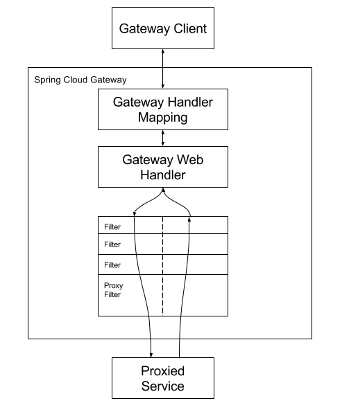

# spring-cloud-gateway

- Route
- Predicate
- Filter

## How it Works

客户端向SpringCloudGateway提出请求。如果Gateway Handler映射确定请求与路由匹配，则将其发送到Gateway Web Handler。此处理程序通过特定于请求的筛选链发送请求。过滤器被虚线除以的原因是，过滤器可以在发送代理请求之前或之后执行逻辑。执行所有“预”筛选逻辑，然后发出代理请求。在发出代理请求后，执行“POST”筛选逻辑。